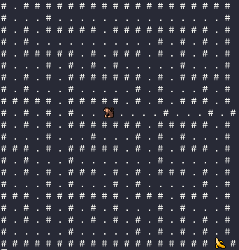

## EL LABERINTO DE MAKO!

Ayuda a Mako a encontrar su banana, completa el laberinto lleno de obstáculos para que Mako obtenga una apetitosa recompensa.

Para jugar, debes instalar la liberia [readchar](https://pypi.org/project/readchar/) e implementar el codigo desde la consola. 

Usa las flechas del teclado (↑ ↓ ← →) para guiar a Mako y moverte por el laberinto. El juego te muestra donde esta Mako y los diferentes caminos que puedes recorrer delineados con puntos.

Pero cuidado, si te chocas con una pared (#), tendrás que retroceder y buscar otro camino. El juego es dinámico y divertido, ya que cada vez que completas un laberinto, se carga uno nuevo para buscar mas bananas. Así nunca te aburrirás de explorar estos laberintos!

¿Estás listo para el reto?

###### Este programa hace uso de Maze Generator disponible en dCode.fr [online website], recuperada el 2023-08-09, https://www.dcode.fr/maze-generator